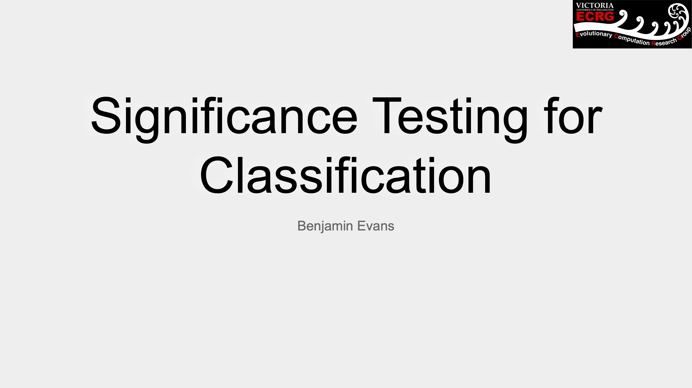
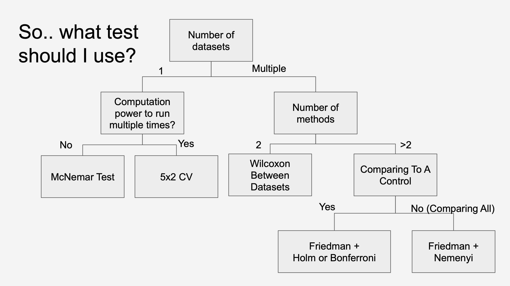

# Statistical Comparisons of Classifiers in Python

Here is a summary on the currently suggested statistical tests for comparing classification algorithms.
All work is implemented in python.

A summary of the current ltierature is given in the slides below

## Just tell me what to use (TLDR)

## Statistical comparisons of 2 classifiers on a single dataset

The suggestion in 
[Approximate statistical tests for comparing supervised classification learning algorithms (1998)](https://www.mitpressjournals.org/doi/pdfplus/10.1162/089976698300017197) is to perform a 5x2 t-test. This was further extended in [Combined 5 × 2 cv F Test for Comparing Supervised Classification Learning Algorithms](https://www.cmpe.boun.edu.tr/~ethem/files/papers/NC110804.PDF) to the 5x2 f-test which is also [recommended](https://twitter.com/tdietterich/status/955280111481208834) by the original authors above to be the new standard.

These tests are implemented in [mlxtend](https://www.github.com/rasbt/mlxtend)

[5x2 t-test](http://rasbt.github.io/mlxtend/user_guide/evaluate/paired_ttest_5x2cv/) (Note: prefer extension below)

[5x2 F-test](http://rasbt.github.io/mlxtend/user_guide/evaluate/combined_ftest_5x2cv/)

Alternatively, if computational resources only allow a method to be run a single time (unlike the 10 times required above), the only acceptable statistical test appears to be the McNemars test, which is also [implemented in mlxtend](http://rasbt.github.io/mlxtend/user_guide/evaluate/mcnemar/). 

## Statistical comparisons of 2 classifiers on multiple datasets

If we are comparing 2 classifiers across several datasets, the suggestion in [Statistical Comparisons of Classifiers over Multiple Data Sets (2006)](http://citeseerx.ist.psu.edu/viewdoc/download?doi=10.1.1.141.3142&rep=rep1&type=pdf) is to perform Wilcoxon Signed-Rank Tests between the datasets.

This is shown in: 

## Statistical comparisons of multiple classifiers over multiple data sets

If we are comparing multiple methods across multiple datasets, the suggestions in [Statistical Comparisons of Classifiers over Multiple Data Sets (2006)](http://citeseerx.ist.psu.edu/viewdoc/download?doi=10.1.1.141.3142&rep=rep1&type=pdf) are to perform a Friedman test, paired with either Nemenyi post hoc analysis (for comparing all methods), or FWER correction if comparing to a control classifier (i.e. comparing several methods to one dataset, not pairwise comparisons).

Both tests are shown in the following  [Jupyter notebook](StatisticalTests.ipynb)
